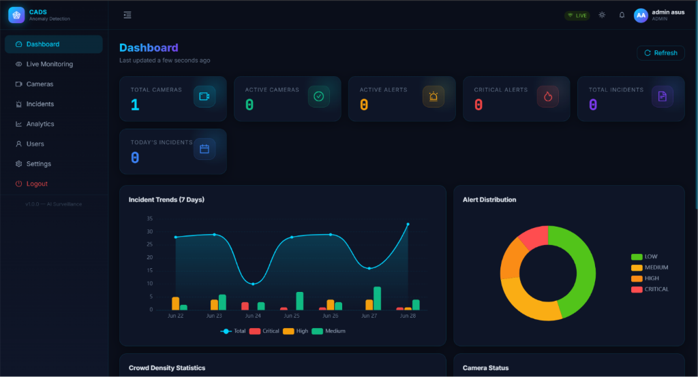
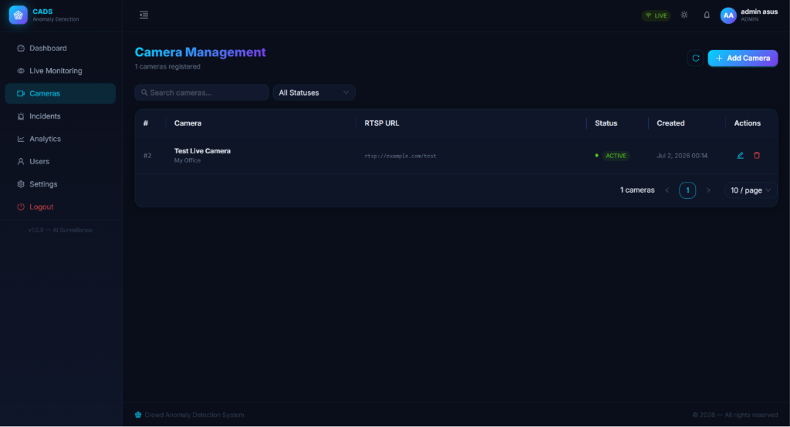
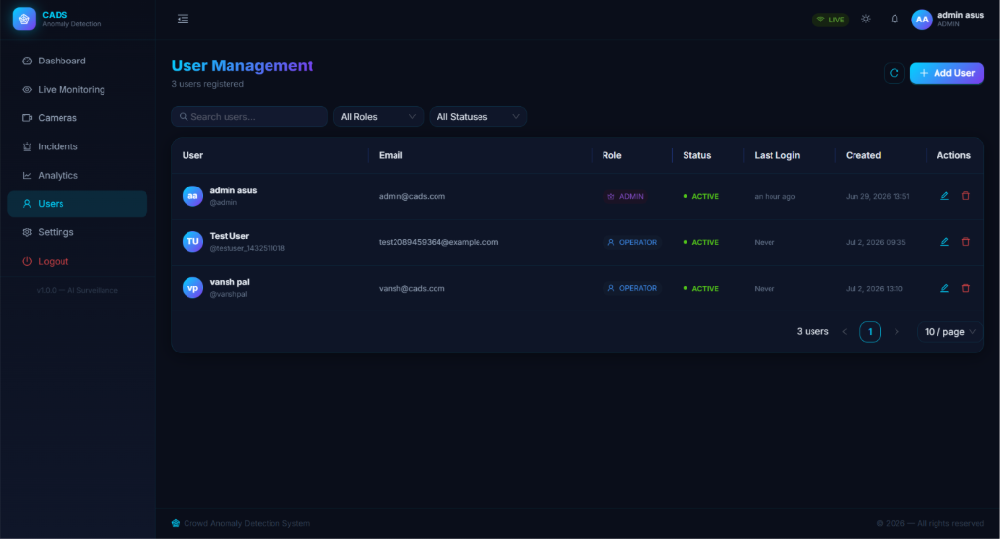
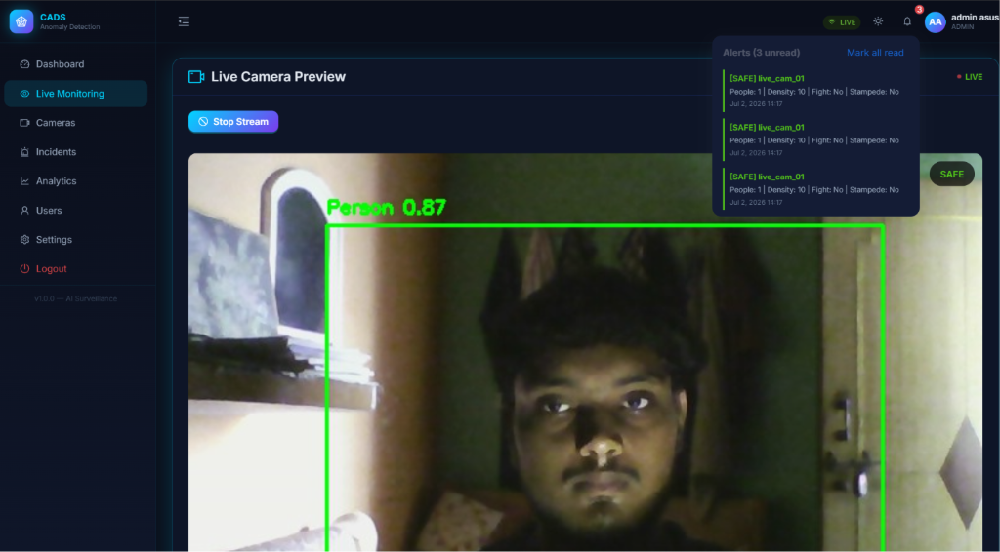

# Crowd Anomaly Detection System

A real-time crowd anomaly detection system using computer vision and deep learning. The system monitors video feeds for anomalies like fights, stampedes, and overcrowding, with alerts sent via Telegram.

## Project Overview
This system consists of three main components:
1. **ML Server (FastAPI)**: Performs real-time video analysis using:
   - YOLOv8: People detection and counting
   - CSRNet: Crowd density estimation
   - CNN-LSTM: Violence detection
   - Optical Flow: Stampede detection
2. **Backend (Spring Boot 3.3.4)**: Manages users, cameras, incidents, and WebSocket communication
3. **Frontend (React 19 + Vite + Ant Design)**: User interface for monitoring, camera management, and incident review

## Features
- Real-time camera feed analysis
- Multiple alert levels (SAFE, WARNING, DANGER, CRITICAL)
- Telegram integration for instant alerts
- Role-based access control (ADMIN / OPERATOR)
- WebSocket for live updates
- Incident history and review
- Dashboard with charts and analytics

## Tech Stack
### ML Server
- FastAPI
- YOLOv8 (Ultralytics)
- TensorFlow / Keras
- PyTorch
- OpenCV
- NumPy
- python-telegram-bot

### Backend
- Java 21
- Spring Boot 3.3.4
- Spring Security + JWT
- Spring Data JPA
- MySQL
- WebSocket (STOMP)
- OpenFeign (for ML API communication)

### Frontend
- React 19
- Vite
- Ant Design
- Redux Toolkit
- React Router

## Setup Instructions
### Prerequisites
- Java 21
- Node.js 20+
- Python 3.10+
- MySQL 8.0+
- WSL2 (for GPU acceleration with CUDA on Windows)
- Telegram bot token (for alerts)

### 1. Clone the Repository
```bash
git clone https://github.com/Vansh-2102/Crowd-Anomaly-Detection-System.git
cd Crowd-Anomaly-Detection-System
```

### 2. Backend Setup
1. Navigate to the backend directory:
   ```bash
   cd crowd-anomaly-backend
   ```

2. Configure MySQL in `src/main/resources/application.properties`:
   ```properties
   spring.datasource.url=jdbc:mysql://localhost:3306/crowd_anomaly_db
   spring.datasource.username=your-username
   spring.datasource.password=your-password
   # JWT Secret (generate a secure one)
   jwt.secret=your-super-secret-key
   ```

3. Run the backend:
   ```bash
   ./mvnw.cmd spring-boot:run
   ```

### 3. Frontend Setup
1. Navigate to the frontend directory:
   ```bash
   cd ../crowd-anomaly-frontend
   ```

2. Install dependencies:
   ```bash
   npm install
   ```

3. Start the frontend dev server:
   ```bash
   npm run dev
   ```

### 4. ML Server Setup
1. Navigate to the ML directory:
   ```bash
   cd ../crowd-anomaly-ml
   ```

2. Install dependencies:
   ```bash
   pip install -r requirements.txt
   ```

3. Configure Telegram:
   - Copy `.env.example` to `.env`
   - Update with your Telegram bot token and chat ID:
     ```env
     TELEGRAM_BOT_TOKEN=your-bot-token
     TELEGRAM_CHAT_ID=your-chat-id
     TELEGRAM_ENABLED=true
     ```

4. Start the ML server:
   ```bash
   cd src
   python api.py
   ```

## Usage
### Access the Application
- **Frontend**: http://localhost:5173
- **Backend API**: http://localhost:8080
- **ML API**: http://localhost:8000

### Default Credentials
You can register your own user via the frontend. For admin access, use:
- Username: admin (or create your own admin user)

### Getting Telegram Chat ID
1. Start a chat with your bot on Telegram
2. Send any message to your bot
3. Use your bot's API endpoint to get updates:
   ```
   https://api.telegram.org/bot<YOUR_BOT_TOKEN>/getUpdates
   ```
4. Look for the `chat.id` field in the response

## Project Structure
```
Crowd-Anomaly-Detection-System/
├── crowd-anomaly-backend/      # Spring Boot backend
├── crowd-anomaly-frontend/     # React frontend
└── crowd-anomaly-ml/           # FastAPI ML server
```

## Contributing
Feel free to open issues or submit pull requests!

## License
MIT License








